# GITC Uplift: a picture guide

Every part of the GITC Uplift tab, top to bottom, and what it does.

## Opening the tab

1) Start the game and press **Home** to open ReShade.
2) Click the **GITC Uplift** tab.

## The whole tab

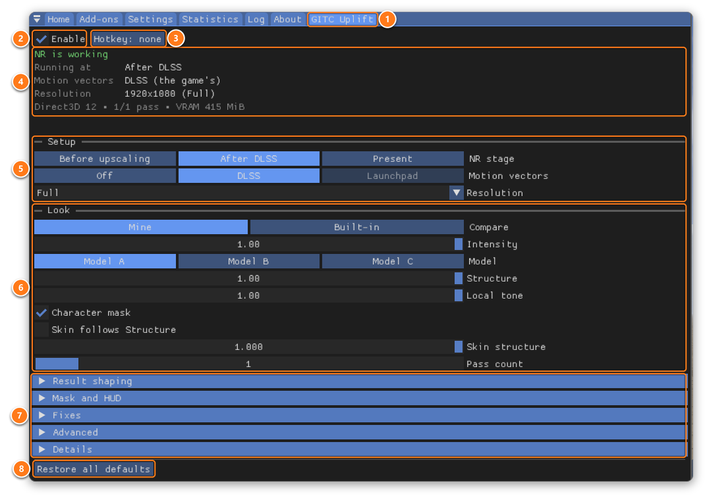

1. **GITC Uplift**: the tab itself, next to ReShade's own.
2. **Enable** switches NR on. Switch it off and NR gives its video memory back after a few seconds.
3. **Hotkey** switches Enable from the game. Click it, then press a key; Esc clears it.
4. **The card** tells you what NR is doing right now. It's green when NR is working; when it isn't, it says why and what to do.
5. **Setup** chooses where NR runs, which motion vectors it uses and the size it works at.
6. **Look** tunes the result to taste.
7. **More sections**, closed until you click them: Result shaping, Mask and HUD, Fixes, Advanced and Details.
8. **Restore all defaults** puts every setting back (the hotkey too; Enable stays as it is). It asks once first.

## The card

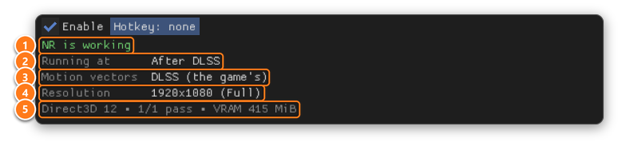

1. **NR is working**: the green title.
2. **Running at**: where NR runs now: Before upscaling, After DLSS or Present.
3. **Motion vectors**: the motion vectors NR gets now.
4. **Resolution**: the size NR works at now.
5. **The footer**: the game's graphics API, the passes NR ran, and the video memory NR uses.

When what runs is not what you chose (for example, After DLSS before the game has started DLSS), a **Why** line says why. Your choice
comes back by itself when it can.

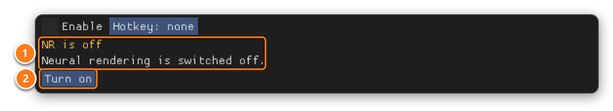

1. When NR isn't working, the title turns amber and says what's wrong, then what to do.
2. When one button can fix it, the card has it: here **Turn on**; elsewhere **Retry now** or **Clear latch**.

## Setup

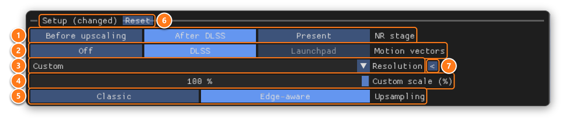

1. **NR stage**: where NR runs.
   **Before upscaling** works on the game's render-size image, and the game's DLSS upscales the result. Cheaper, and experimental.
   **After DLSS** works inside the game's frame, before the HUD and frame generation (games with DLSS).
   **Present** works on the finished image, HUD included. It works in every game.
2. **Motion vectors**: **Off**, **DLSS** (the game's own) or **Launchpad** (iMMERSE Launchpad's, at Present, with `Uplift.fx`'s
   Uplift technique below Launchpad).
3. **Resolution**: the size NR works at. **Full** looks best. Quality, Balanced and Performance are faster and use less memory.
   **Match game** follows the game's DLSS render size. **Custom** lets you pick.
4. **Custom scale (%)**: only with Custom: the size in percent of the image.
5. **Upsampling**: only below Full: how NR's change is scaled back up. **Edge-aware** keeps it on the right side of edges;
   **Classic** is slightly cheaper.
6. **(changed)**: you changed something in this section. **Reset** puts Setup back.
7. **<** resets just this row. Every row you changed has one.

The highlighted option is always the one that runs.

### Greyed options

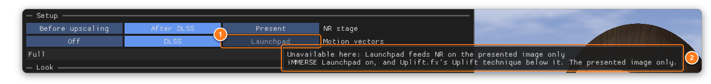

1. An option that can't work in your game right now is greyed out.
2. Hover over it to see why. Your choice is remembered and comes back by itself when it can.

## Look

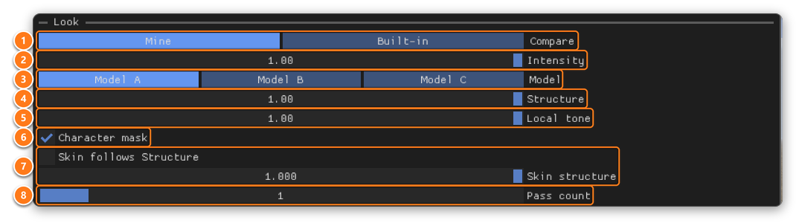

1. **Compare**: **Built-in** shows the default look so you can compare; your own settings are kept. **Mine** goes back to them.
2. **Intensity**: how strongly NR changes the image. Ctrl+click to type a value above 1.
3. **Model**: the NR model, A, B or C.
4. **Structure**: the fine structure NR adds.
5. **Local tone**: the local contrast NR adds.
6. **Character mask**: protects characters with NR's own mask.
7. **Skin structure**: structure on skin. Tick **Skin follows Structure** to use Structure's value.
8. **Pass count**: runs NR again on its own result. Each extra pass costs as much as the first. From 2, each pass gets its own
   **Pass** tree: the same as pass 1, or its own settings.

## Result shaping

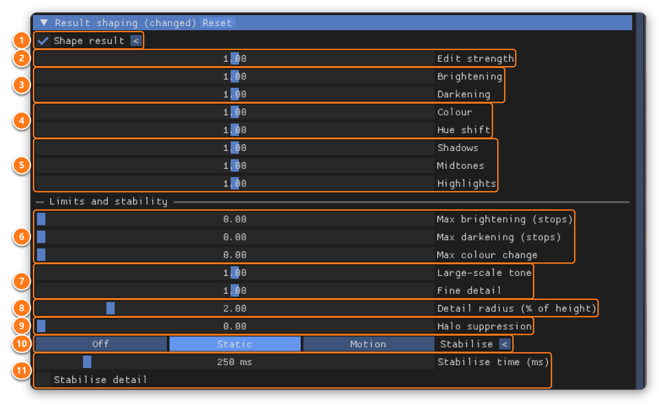

1. **Shape result**: reshapes NR's result live. Off leaves NR's output exactly as it is. The rows below appear when it's on.
2. **Edit strength**: 0 removes NR's change, 1 keeps it, 2 doubles it.
3. **Brightening** and **Darkening**: how much of NR's brightening and darkening is kept.
4. **Colour** and **Hue shift**: how far NR changes saturation and hues. 0 keeps the game's.
5. **Shadows**, **Midtones** and **Highlights**: scale NR's change in the dark, middle and bright parts of the image.
6. **Max brightening**, **Max darkening** and **Max colour change**: soft caps on how far a pixel can change. 0 is no cap.
7. **Large-scale tone** and **Fine detail**: scale NR's broad lighting change and its small-scale change.
8. **Detail radius**: where broad change ends and fine detail begins.
9. **Halo suppression**: reduces the dark rings NR leaves next to bright objects.
10. **Stabilise**: smooths NR's broad change over time. **Static** suits still views, **Motion** moving ones.
11. **Stabilise time** and **Stabilise detail**: longer is steadier but slower to follow lighting; detail smooths the small-scale
    change too. They appear when Stabilise isn't Off.

## Mask and HUD

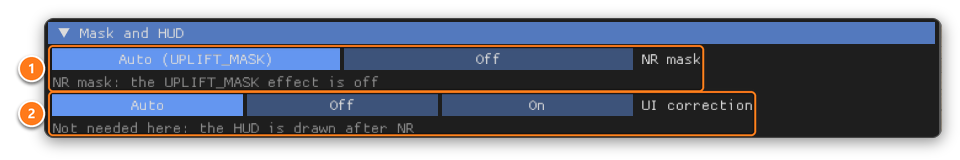

1. **NR mask**: with **Auto**, an effect can limit where NR works. `UpliftMask.fx` is an example. **Off** ignores it. The grey line
   below says what the mask is doing now.
2. **UI correction**: NR's own HUD protection. After DLSS it isn't needed (the HUD is drawn after NR); at Present, use the NR mask
   instead. The grey line below says whether it's needed here.

## Fixes

Only change these if you know what you are doing.

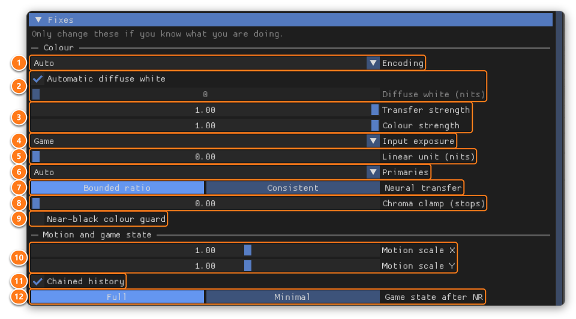

1. **Encoding**: how the image is encoded. Auto follows the game.
2. **Diffuse white (nits)**: the brightness NR treats as paper white. Untick **Automatic diffuse white** to set it yourself.
3. **Transfer strength** and **Colour strength**: how much of NR's brightness and colour change reaches the image.
4. **Input exposure**: where NR's input brightness comes from in HDR games. With Auto or Metered, three **Adaptation** rows appear.
5. **Linear unit (nits)**: the nits of 1.0 in a linear or scRGB image. 0 is automatic.
6. **Primaries**: the image's colour primaries. Auto suits almost every game.
7. **Neural transfer**: how NR's change returns to HDR.
8. **Chroma clamp (stops)**: keeps each colour's change close to the brightness change. 0 is off.
9. **Near-black colour guard**: stops noise near black from turning into green or grey specks.
10. **Motion scale X** and **Y**: multiply the motion NR is given. A negative value flips the axis.
11. **Chained history**: off resets passes 2 and later every frame (for testing).
12. **Game state after NR**: what Uplift restores after NR runs inside the game's frame. Greyed when NR can't run there.

## Advanced

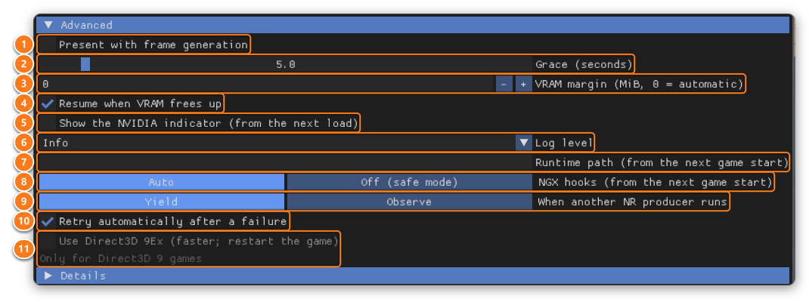

1. **Present with frame generation**: lets NR at Present run while frame generation is on: on every frame, at twice the cost or more.
2. **Grace (seconds)**: how long NR keeps its memory after you switch it off, so a quick toggle doesn't reload it.
3. **VRAM margin**: video memory NR always leaves free for the game. 0 is automatic.
4. **Resume when VRAM frees up**: after NR paused because the game needed video memory.
5. **Show the NVIDIA indicator**: NVIDIA's on-screen NR indicator, from the next load.
6. **Log level**: how much Uplift writes to `ReShade.log`.
7. **Runtime path**: where `nvngx_dlssnr.dll` is. Empty looks next to the add-on, then next to the game. From the next game start.
8. **NGX hooks**: **Off** is safe mode: nothing is hooked, and NR runs at Present only. From the next game start.
9. **When another NR producer runs**: **Yield** stands down while another NR tool runs in the game; **Observe** keeps going.
10. **Retry automatically after a failure**: retries after 1, 2, 4, 8, 16 and 30 seconds, then waits for you.
11. **Use Direct3D 9Ex**: Direct3D 9 games only (greyed elsewhere). Much faster; restart the game. If the game then won't start,
    start it again: Uplift turns this off by itself.

## Details

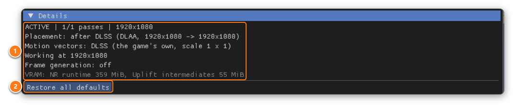

1. **Details**: everything Uplift knows right now, one line each: its state, where NR runs, the motion vectors, the size it works
   at, frame generation and video memory. Include these lines when you report a problem.
2. **Restore all defaults**: every setting back to its default. It asks once first.

## The card's messages

- **"NR is off"**: tick **Enable**, or press **Turn on**.
- **"The NR runtime was not found"**: put `nvngx_dlssnr.dll` next to the add-ons and restart the game.
- **"NR failed"**, with an NVIDIA error code: your `nvngx_dlssnr.dll` doesn't work with your card, or your driver is out of date.
- **"NR needs at least 1280x720"**: raise the game's resolution or window size.
- **"Another NR tool is running"**: remove the other DLSS5 add-on and restart the game.

More in the README: [If something's wrong](../README.md#if-somethings-wrong).

[Back to the README](../README.md)
